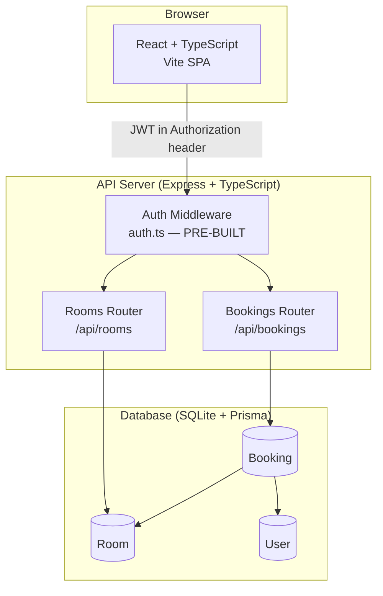
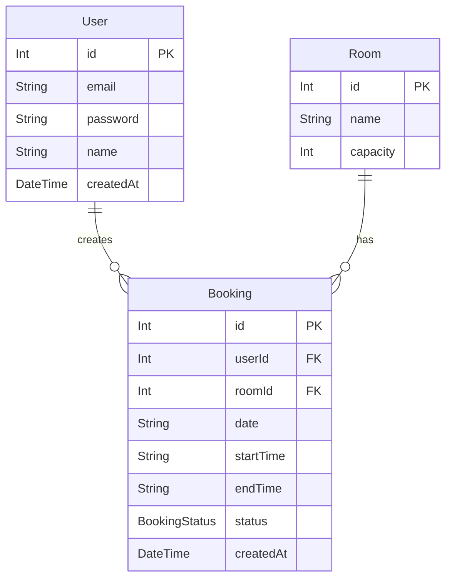
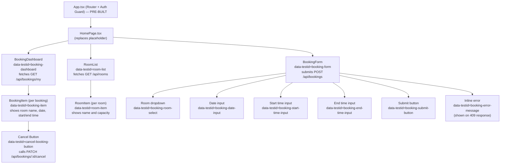
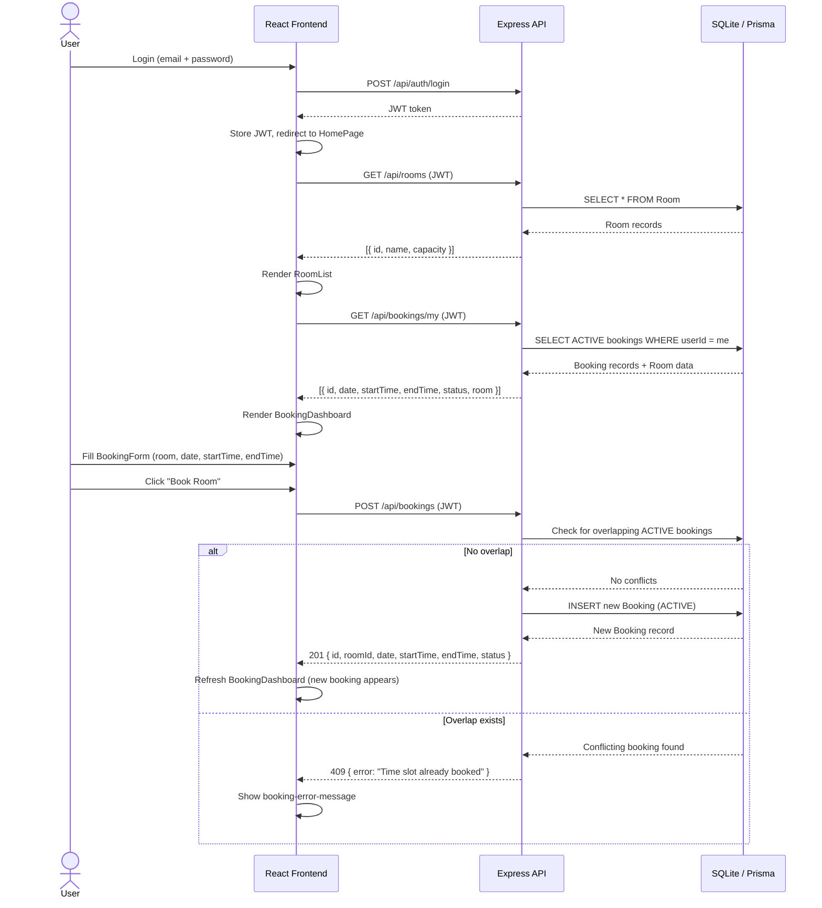
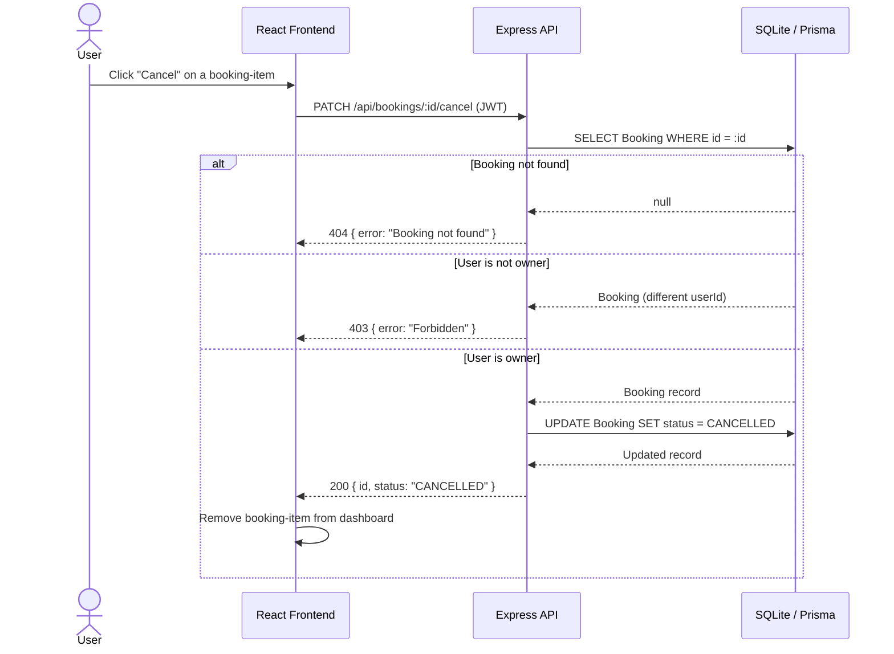

# BookItApp — Design Document
**Date:** 2026-03-17
**Source:** BRD.md + User Story Issues

---

## 1. Architecture Overview

BookItApp is a three-tier web application: a React + TypeScript frontend, an Express + TypeScript REST API, and a SQLite database accessed through Prisma ORM. Authentication is handled entirely by the pre-built JWT middleware — no new auth work is required.



---

## 2. Data Model

### Prisma Schema (complete)

```prisma
generator client {
  provider = "prisma-client-js"
}

datasource db {
  provider = "sqlite"
  url      = env("DATABASE_URL")
}

// PRE-BUILT — do not modify
model User {
  id        Int       @id @default(autoincrement())
  email     String    @unique
  password  String
  name      String
  createdAt DateTime  @default(now())
  bookings  Booking[]
}

// NEW
enum BookingStatus {
  ACTIVE
  CANCELLED
}

// NEW
model Room {
  id       Int       @id @default(autoincrement())
  name     String
  capacity Int
  bookings Booking[]
}

// NEW
model Booking {
  id        Int           @id @default(autoincrement())
  userId    Int
  roomId    Int
  date      String
  startTime String
  endTime   String
  status    BookingStatus @default(ACTIVE)
  createdAt DateTime      @default(now())
  user      User          @relation(fields: [userId], references: [id])
  room      Room          @relation(fields: [roomId], references: [id])
}
```

### ER Diagram



---

## 3. API Endpoints

| Method | Path | Description | Auth Required |
|--------|------|-------------|---------------|
| GET | `/api/rooms` | List all rooms | Yes |
| POST | `/api/bookings` | Create a new booking | Yes |
| GET | `/api/bookings/my` | List authenticated user's ACTIVE bookings | Yes |
| PATCH | `/api/bookings/:id/cancel` | Cancel a booking owned by the authenticated user | Yes |

### Request / Response Shapes

**GET /api/rooms**
- Response `200`: `[{ id, name, capacity }]`

**POST /api/bookings**
- Request: `{ roomId: number, date: string, startTime: string, endTime: string }`
- Response `201`: `{ id, roomId, date, startTime, endTime, status }`
- Response `409`: `{ error: string }` — overlap conflict (an ACTIVE booking for the same room on the same date where `requestedStart < existingEnd AND requestedEnd > existingStart`)
- Response `401`: `{ error: string }` — missing or invalid JWT

**GET /api/bookings/my**
- Response `200`: `[{ id, date, startTime, endTime, status, room: { id, name, capacity } }]`

**PATCH /api/bookings/:id/cancel**
- Response `200`: `{ id, status: "CANCELLED" }`
- Response `403`: `{ error: string }` — authenticated user does not own this booking
- Response `404`: `{ error: string }` — booking does not exist
- Response `401`: `{ error: string }` — missing or invalid JWT

> **Route ordering note:** Register `GET /api/bookings/my` **before** any `/:id` route in the bookings router to prevent Express treating `"my"` as an id parameter.

---

## 4. Component Structure



### data-testid Reference

| data-testid | Element | Purpose |
|---|---|---|
| `room-list` | RoomList container | Verify room list is rendered |
| `room-item` | Each room card/row | Verify individual rooms show name and capacity |
| `booking-form` | BookingForm element | Locate and interact with the booking form |
| `booking-room-select` | Room dropdown | Select a room when creating a booking |
| `booking-date-input` | Date input | Fill the booking date |
| `booking-start-time-input` | Start time input | Fill the booking start time |
| `booking-end-time-input` | End time input | Fill the booking end time |
| `booking-submit-button` | Submit button | Submit the booking form |
| `booking-error-message` | Inline error message | Verify overlap conflict error (409) |
| `booking-dashboard` | BookingDashboard container | Verify dashboard renders bookings |
| `booking-item` | Each booking row | Verify individual bookings appear |
| `cancel-booking-button` | Cancel button per booking | Cancel a booking and verify removal |

---

## 5. Key Flows

### Primary Booking Journey



### Booking Cancellation Flow



---

## 6. Seed Data

### Room

| id | name | capacity |
|----|------|----------|
| 1 | Boardroom | 12 |
| 2 | Conference Room A | 8 |
| 3 | Conference Room B | 6 |
| 4 | Huddle Space | 4 |

### Booking (for test@example.com)

| userId | roomId | date | startTime | endTime | status |
|--------|--------|------|-----------|---------|--------|
| (test user id) | 1 (Boardroom) | today (YYYY-MM-DD) | 09:00 | 10:00 | ACTIVE |
| (test user id) | 2 (Conference Room A) | today (YYYY-MM-DD) | 14:00 | 15:30 | ACTIVE |
| (test user id) | 4 (Huddle Space) | tomorrow (YYYY-MM-DD) | 11:00 | 12:00 | ACTIVE |

> Seed ts implementation must look up `test@example.com` by email (`prisma.user.findFirst`) and use the returned user's `id` as `userId` for all Booking seed records. Date values must be computed at seed-run time using `new Date().toISOString().split('T')[0]` for today and an equivalent computation for tomorrow.

---

## 7. Implementation Order

Assign Issues to Copilot Coding Agent in this order:

| Step | Issue | Depends On |
|------|-------|------------|
| 1 | [DATABASE] Room Browsing and Booking | — |
| 2 | [BACKEND] Room Browsing and Booking | Step 1 merged |
| 3 | [BACKEND] Booking Cancellation | Step 2 merged |
| 4 | [FRONTEND] Room Browsing and Booking | Step 3 merged |
| 5 | [FRONTEND] Booking Cancellation | Step 4 merged |
| 6 | [PLAYWRIGHT] Room Booking | Step 5 merged |
